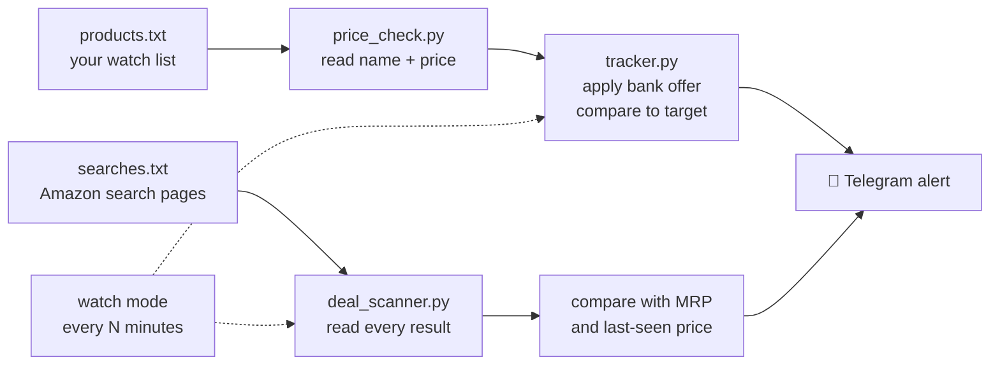

# 🛒 Sale Deal Tracker

**Never miss a Big Billion Days or Great Indian Festival deal again.**
A small Python tool that watches Amazon.in and Flipkart prices, works out the *real* price after bank offers, and pings your phone on Telegram the moment something hits your target.

<!-- TODO: add a 20–30 second demo GIF: terminal running → Telegram alert arriving on phone -->
<!--  -->

---

## The problem

During big Indian sales, the best deals last minutes, and the price you see isn't the price you pay: bank card offers, cashback and coupons change it. To catch a deal you'd have to:

- refresh 10–20 product pages over and over, for days,
- redo the bank-offer maths each time, and
- still be looking at the exact moment the price drops.

Nobody does that well. So most people either overpay or miss the deal.

## The decision: why this is *not* an auto-buying bot

My first idea was an AI agent that buys the product by itself the second the price drops. I scoped it out and dropped it:

| Blocker | Why it kills full automation |
|---|---|
| **Payments** | RBI rules require OTP / UPI PIN authentication for most online payments, so a bot can't finish checkout on its own. |
| **Terms of service** | Amazon and Flipkart prohibit automated purchasing; accounts can be suspended. |
| **Bot detection** | CAPTCHAs, fingerprinting and rate limits are strictest on sale days. |
| **Fairness** | A bot that grabs limited stock faster than people is a scalping tool. |

So I redesigned it as **human-in-the-loop**: the tool does the boring part (watching, calculating, alerting), and a person makes the purchase with one tap. It's simpler, stays within the rules, and solves the real pain, which is *missing the moment*.

## What it does

- **Price tracking:** reads the name and current price from Amazon.in and Flipkart product pages.
- **Real price after bank offers:** handles `10% HDFC max 1000`, `5% ICICI`, `flat 1500 SBI` style offers.
- **Target alerts:** tells you when the price after the offer is at or below your target.
- **Telegram notifications:** the alert, with a buy link, lands on your phone instantly.
- **Watch mode:** checks automatically every N minutes, with no repeat spam (you get one alert per deal, and another only if the price drops further).
- **Bulk add:** paste many links at once; names, prices and targets are filled in for you.
- **Deal scanner:** scans a whole Amazon search page (e.g. "phones under ₹20,000") and flags big discounts *and* real price drops since the last scan.

## How it works



A note on the "real drop" signal: sellers sometimes inflate the MRP to make discounts look bigger, so the scanner also remembers prices between runs and alerts on genuine drops, not just a big "% off".

## Quick start

**1. Install** (Python 3.10+):
```bash
pip install -r requirements.txt
```

**2. Connect Telegram** (one time):
1. In Telegram, message **@BotFather**, send `/newbot`, and copy the token.
2. Send your new bot any message ("hi").
3. Run `python telegram_setup.py` and paste the token. You'll get a test message.

**3. Add products**, either by pasting links:
```bash
python add_products.py
```
or by editing `products.txt` (one per line):
```
name | link | target price | bank offer (optional)
MSI motherboard | https://www.amazon.in/dp/B0CC9G49JQ | 5000 | flat 275 ICICI
```

**4. Run it:**
```bash
python tracker.py            # check once
python tracker.py watch      # check every 10 minutes (Ctrl+C to stop)
python deal_scanner.py watch # scan search pages every 15 minutes
```

## Files

| File | What it does |
|---|---|
| `price_check.py` | Reads the product name and price from a product page |
| `tracker.py` | Checks your watch list, applies offers, sends alerts, watch mode |
| `add_products.py` | Adds many products at once from pasted links |
| `deal_scanner.py` | Finds deals on Amazon search pages |
| `telegram_setup.py` | One-time Telegram connection |
| `products.txt` / `searches.txt` | Your watch list and searches |

## How I built it: AI as a pair programmer

I built this with **Claude** as my coding partner. The split:

- **Me:** the problem framing, the decision to scope down to human-in-the-loop, breaking it into small shippable steps, testing every step against the live sites, and debugging from real output.
- **AI:** writing most of the code from that plan, and suggesting fixes.

The AI couldn't reach Amazon itself, so every fix had to be proved on my machine. Some real problems I hit along the way:

- **Amazon returned a fake `404 Not Found`** to the script because it looked like a bot. I fixed it by cleaning the tracking junk out of the link and behaving more like a browser (warming up cookies first).
- **The page loaded, but "no price found."** Amazon sends scripts a different page layout than browsers, so the price wasn't where expected. I added fallbacks that read it from hidden fields and embedded JSON.
- **A bot token leaked in a screenshot.** I revoked it immediately, and added a token check plus a `.gitignore` so secrets never reach the repo.

The lesson: AI makes building fast, but *verifying against reality* is still the job.

## Results

<!-- TODO: fill in after running it through the sale -->
Tested during the **Great Indian Festival 2026**:

- Products tracked: **_**
- Alerts received: **_**
- Most price changes seen for one product in a day: **_**
- Money saved vs. buying on day one: **₹_**
- Friends who tried it: **_**. What they asked for: **_**

## Limitations

- **Page changes break scraping.** Amazon and Flipkart change their pages often; the price reader has fallbacks but will need maintenance.
- **Bank offers are entered by hand** for now, because offers load separately from the main page.
- **The deal scanner is Amazon-only**, and search pages get rate-limited faster, so keep the gap at 15+ minutes.
- **It runs on your computer**, which has to stay awake during the sale.

## Roadmap

- [ ] Read bank offers automatically (likely needs a real browser via Playwright)
- [ ] Add products by sharing a link to the Telegram bot (`/add <link> <target>`)
- [ ] Automatic targets based on the lowest price seen
- [ ] Flipkart support for the deal scanner
- [ ] Run in the cloud so the laptop can sleep
- [ ] "Sale co-pilot": pre-fill the cart and hand over at checkout for one-tap approval

## Responsible use

This tool only *reads* public product pages at a slow, human-like pace (minutes apart) and never logs in or buys. Please keep it that way: don't lower the wait times, and respect each site's terms.

---

Built by [Ambar Banerjee](https://www.linkedin.com/in/ambar-banerjee/)
